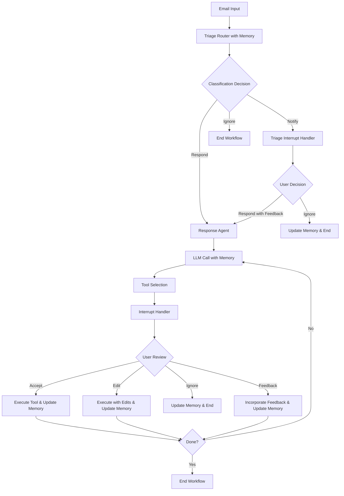

# Email Assistant Agent Workflow with Memory (HITL)

## Overview

The Email Assistant Agent with Human-in-the-Loop (HITL) and Memory capabilities is an intelligent system that processes incoming emails, learns from user interactions, and continuously improves its decision-making. The agent uses persistent memory to store user preferences across three key areas: triage decisions, response preferences, and calendar preferences.

## High-Level Workflow



## Detailed Workflow Steps

### 1. Email Input Processing

**What happens**: The agent receives an email with author, recipient, subject, and email thread content.

**Example Email**:
```
From: john.doe@company.com
To: assistant@yourcompany.com
Subject: Meeting Request - Q4 Planning
Body: Hi, I'd like to schedule a meeting next week to discuss Q4 planning. 
      Are you available Tuesday or Wednesday afternoon?
```

### 2. Triage Router with Memory

**What happens**: The agent analyzes the email and decides whether to respond, notify, or ignore it using learned triage preferences.

**Memory Integration**:
- Retrieves stored triage preferences: `get_memory(store, ("email_assistant", "triage_preferences"), DEFAULT_TRIAGE_INSTRUCTIONS)`
- Uses learned preferences to make more accurate classification decisions

**Example Classifications**:

**Scenario A - Business Meeting Request**:
- **Classification**: "respond" 
- **Reasoning**: Previous interactions showed user always responds to meeting requests from internal colleagues
- **Memory Learning**: If user had previously ignored similar requests, the agent would learn to classify as "notify" instead

**Scenario B - Marketing Email**:
- **Classification**: "ignore"
- **Reasoning**: Learned from past user behavior that promotional emails should be automatically ignored
- **Memory Learning**: Initially might have been "notify", but user consistently ignored them

**Scenario C - Important Announcement**:
- **Classification**: "notify"
- **Reasoning**: Company-wide announcements need user awareness but don't require immediate response
- **Memory Learning**: User preferences determine which announcements are truly important

### 3. Classification Outcomes

#### 3A. Respond Classification

**Flow**: Email → Response Agent → LLM Call with Memory

**Example**:
```
Input: Meeting request from colleague
Classification: respond
Next: Proceeds directly to Response Agent
Memory Used: Response and calendar preferences guide email drafting
```

#### 3B. Ignore Classification

**Flow**: Email → End Workflow

**Example**:
```
Input: Newsletter subscription
Classification: ignore  
Next: Workflow ends immediately
Memory Used: Triage preferences determined this type should be ignored
```

#### 3C. Notify Classification

**Flow**: Email → Triage Interrupt Handler → Human Review

**Example**:
```
Input: Company policy update
Classification: notify
Next: Human review required
Memory Impact: User decision updates triage preferences
```

### 4. Triage Interrupt Handler (Notify Path)

**What happens**: When an email is classified as "notify", the system presents it to the user for decision.

**User Options**:
1. **Respond with Feedback**: User provides input on how to respond
2. **Ignore**: User decides the email doesn't need response

**Memory Updates**:

**Example A - User Responds**:
```
Email: "Server maintenance scheduled for weekend"
User Action: Provides feedback "Acknowledge and ask about impact on our project"
Memory Update: 
- Updates triage preferences to note user responds to infrastructure updates
- Creates message for Response Agent with user feedback
```

**Example B - User Ignores**:
```
Email: "New employee welcome announcement"  
User Action: Chooses to ignore
Memory Update:
- Updates triage preferences to classify similar announcements as "ignore" in future
- Learns user doesn't respond to general HR announcements
```

### 5. Response Agent with Memory

**What happens**: The Response Agent uses learned preferences to craft appropriate responses.

**Memory Integration**:
- **Response Preferences**: `get_memory(store, ("email_assistant", "response_preferences"), DEFAULT_RESPONSE_PREFERENCES)`
- **Calendar Preferences**: `get_memory(store, ("email_assistant", "cal_preferences"), DEFAULT_CAL_PREFERENCES)`

**Example Response Preferences Learned**:
```
User Preference: "Keep emails concise and professional"
User Preference: "Always offer specific time slots for meetings"
User Preference: "Include agenda items when scheduling meetings"
User Preference: "Use formal tone for external communications"
```

### 6. LLM Call with Memory-Enhanced Prompts

**What happens**: The LLM receives a system prompt enriched with learned user preferences.

**Example Enhanced Prompt**:
```
System Prompt: 
- Background: "You are an executive assistant for a busy VP of Engineering"
- Response Preferences: "Keep emails under 100 words, always propose specific times, include meeting agendas"
- Calendar Preferences: "Prefer Tuesday-Thursday 2-4pm, avoid early mornings, block 30-min buffers"
- Tools Available: write_email, schedule_meeting, check_calendar_availability, Question, Done
```

### 7. Tool Selection and Interrupt Handler

**What happens**: The LLM selects appropriate tools, and human review is required for sensitive actions.

**HITL Tools (Require Human Review)**:
- `write_email`: Email drafts need approval
- `schedule_meeting`: Calendar invitations need approval  
- `Question`: Questions to user need approval

**Auto-Execute Tools**:
- `check_calendar_availability`: Safe to run automatically
- `Done`: Workflow completion

### 8. Human Review and Memory Learning

**What happens**: User reviews tool calls and provides feedback that updates memory.

#### 8A. Email Writing Example

**Initial Tool Call**:
```
Tool: write_email
Args: {
  "to": "john.doe@company.com",
  "subject": "Re: Meeting Request - Q4 Planning", 
  "content": "Hi John,\n\nI'd be happy to discuss Q4 planning. I have availability Tuesday 2-3pm or Wednesday 3-4pm. Would either time work for you?\n\nBest regards"
}
```

**User Actions and Memory Updates**:

**Accept**: 
- Tool executes as-is
- No memory update needed

**Edit**:
```
User Edit: Adds "Please prepare agenda items focusing on budget allocation and timeline milestones."
Memory Update: Response preferences learn user wants agenda guidance in meeting requests
```

**Ignore**:
```
User Action: Ignores the email draft
Memory Update: Triage preferences learn this type of meeting request should be classified as "ignore"
Tool Response: "User ignored this email draft. Ignore this email and end the workflow."
```

**Feedback**:
```
User Feedback: "Too formal, use more casual tone with internal colleagues"
Memory Update: Response preferences learn to adjust tone based on recipient relationship
Tool Response: Incorporates feedback into new draft
```

#### 8B. Meeting Scheduling Example

**Initial Tool Call**:
```
Tool: schedule_meeting
Args: {
  "attendees": ["john.doe@company.com"],
  "subject": "Q4 Planning Discussion",
  "datetime": "2025-08-12T14:00:00",
  "duration": 60,
  "description": "Quarterly planning meeting"
}
```

**User Actions and Memory Updates**:

**Edit**:
```
User Edit: Changes duration to 90 minutes, adds location "Conference Room A"
Memory Update: Calendar preferences learn user prefers 90-min planning meetings in specific room
```

**Feedback**:
```
User Feedback: "Always include video conference link for hybrid attendance"
Memory Update: Calendar preferences learn to include video links in all meetings
```

#### 8C. Question Tool Example

**Tool Call**:
```
Tool: Question
Args: {
  "question": "Should I propose alternative dates if John's suggested times don't work?"
}
```

**User Actions**:

**Response**:
```
User Answer: "Yes, and always offer at least 3 alternative time slots"
Memory Update: Response preferences learn to always provide multiple alternatives
```

**Ignore**:
```
User Action: Ignores question
Memory Update: Triage preferences learn this type of clarification isn't needed
```

### 9. Memory Storage and Retrieval

**Memory Namespaces**:
1. `("email_assistant", "triage_preferences")`: Email classification decisions
2. `("email_assistant", "response_preferences")`: Email writing and response style
3. `("email_assistant", "cal_preferences")`: Calendar and meeting preferences

**Memory Update Process**:
1. Collect user interaction data (edits, feedback, ignore actions)
2. Use LLM with structured output to analyze patterns
3. Update relevant memory namespace with refined preferences
4. Store updated preferences for future use

**Example Memory Evolution**:

**Initial State** (Default):
```
Triage: "Respond to all business emails, notify for announcements"
Response: "Professional tone, concise communication"
Calendar: "Standard meeting preferences"
```

**After 10 Interactions**:
```
Triage: "Auto-ignore marketing emails, respond to internal meeting requests, notify for policy changes"
Response: "Casual tone for internal, formal for external, always include agenda items, prefer bullet points"
Calendar: "90-minute meetings for planning, 30-min for status updates, prefer afternoons, always include video links"
```

**After 50 Interactions**:
```
Triage: "Complex rules based on sender domain, subject keywords, and content patterns"
Response: "Personalized style per relationship, context-aware formality, learned phrase preferences"
Calendar: "Optimized scheduling based on meeting types, participant preferences, seasonal patterns"
```

## Workflow Benefits

### 1. Continuous Learning
- Each user interaction improves future decisions
- Preferences become more accurate over time
- Reduces need for manual intervention

### 2. Personalization
- Adapts to individual communication styles
- Learns organizational culture and norms
- Respects user workflow preferences

### 3. Efficiency Gains
- Better initial classifications reduce interruptions
- More accurate initial drafts need fewer edits
- Automated handling of routine scenarios

### 4. Quality Improvement
- Consistent application of learned preferences
- Reduction in user corrections over time
- Enhanced professional communication standards

## Example Complete Workflow

**Email Input**:
```
From: sarah.wilson@client.com
To: assistant@yourcompany.com  
Subject: Project Delay Concerns
Body: We're seeing some delays in the Q4 deliverables. Can we schedule a call this week to discuss mitigation strategies?
```

**Step 1 - Triage (with Memory)**:
- Retrieves learned preference: "Client emails about project issues always get immediate response"
- Classification: "respond"

**Step 2 - Response Agent**:
- Retrieves response preferences: "Client communications need formal tone, quick turnaround"
- Retrieves calendar preferences: "Client calls get priority scheduling, prefer video calls"

**Step 3 - Tool Selection**:
- LLM chooses: `check_calendar_availability` → `schedule_meeting` → `write_email`

**Step 4 - Human Review**:
- Calendar check: Auto-executes (finds availability Thursday 3pm)
- Meeting schedule: User reviews and accepts with minor edit (adds "urgent" to subject)
- Email draft: User provides feedback ("mention we're already working on solutions")

**Step 5 - Memory Updates**:
- Calendar preferences: Learn "urgent client meetings get priority scheduling"
- Response preferences: Learn "acknowledge proactive problem-solving in client communications"

**Step 6 - Execution**:
- Meeting created: "Urgent: Project Delay Discussion" 
- Email sent: Professional response acknowledging concerns and confirming meeting

This memory-enhanced workflow ensures that each interaction makes the assistant smarter and more aligned with user preferences, creating a truly personalized and efficient email management system.
