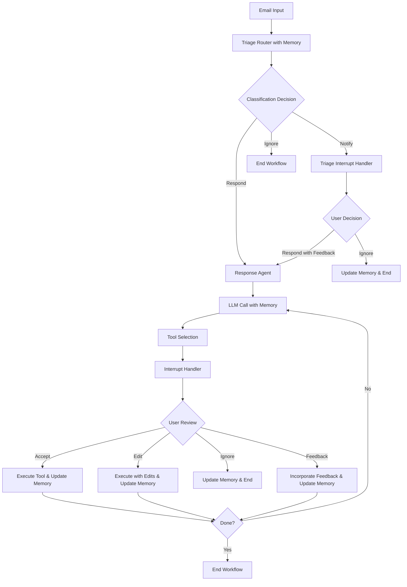

```mermaid
graph TD
    A[Email Input] --> B[Triage Router with Memory]
    B --> C{Classification Decision}
    C -->|Respond| D[Response Agent]
    C -->|Notify| E[Triage Interrupt Handler]
    C -->|Ignore| F[End Workflow]
    E --> G{User Decision}
    G -->|Respond with Feedback| D
    G -->|Ignore| H[Update Memory & End]
    D --> I[LLM Call with Memory]
    I --> J[Tool Selection]
    J --> K[Interrupt Handler]
    K --> L{User Review}
    L -->|Accept| M[Execute Tool & Update Memory]
    L -->|Edit| N[Execute with Edits & Update Memory]
    L -->|Ignore| O[Update Memory & End]
    L -->|Feedback| P[Incorporate Feedback & Update Memory]
    M --> Q{Done?}
    N --> Q
    P --> Q
    Q -->|No| I
    Q -->|Yes| R[End Workflow]
```